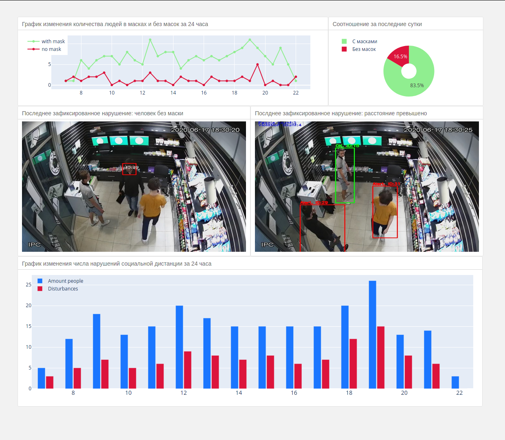

# Pandemic Vision

Статистика нарушений коронавирусного режима.  

Применяется к видеопотоку для обнаружения нарушений ограничений, введенных в связи с коронавирусом.  
Модуль позволяет собрать статистику и построить дашборд, отображающий скриншоты нарушений, а таже же элементарные графики за последние 24 часа.  
Так как модуль был написан для небольшого магазина, то графики отображаются только за время работы магазина.  

Все данные о нарушениях сохраняются в `.csv` файлы (отдельно для нарушения социальной дистанции и отдельно для людей без масок)  

Перед использованием необходимо скачать [веса](https://drive.google.com/drive/folders/1EKFkLothr-JZqdVtKciUt6H9kbxs7BXu?usp=sharing "перейти по ссылке") и поместить их в директорию `weights`.  
Вся статистика сохраняется в директорию `statistics`: `data` - это `csv` файлы с данными, а `screenshots` содержит субдиректории `masks` и `dastance`, куда сохраняются скриншоты нарушений ношения маски и нарушений социальной дистанции, зафиксированные во время работы скрипта. По умолчанию у меня сохранятся только последний скриншот.  
Кастомное видео необходимо поместить в директорию `videos`, а затем указать путь к нему в переменной `video_path` файла `configs/main.config.py` 
Графики по умолчанию сохраняются в директорию `graphics` и обнавляются во время каждой итерации.
Для того, чтобы просмотреть дашборд, нужно скопировать вадресную строку браузера путь к файлу `/dash/index.html`

Для запуска полного скрипта нужно из диретории с проектом запустить `python analize -m all -s enabled`
+ `-m [mode] masks/dist/all` - можно выбрать отслеживание только нарушений режима ношения масок или только нарушений социальной дистанции
+ `-s [statistics] enabled/disabled` - записывать статистику в .csv-файлы или нет

`Dockerfile` пока что не протестирован, зависимости указаны в `requirements.txt`
